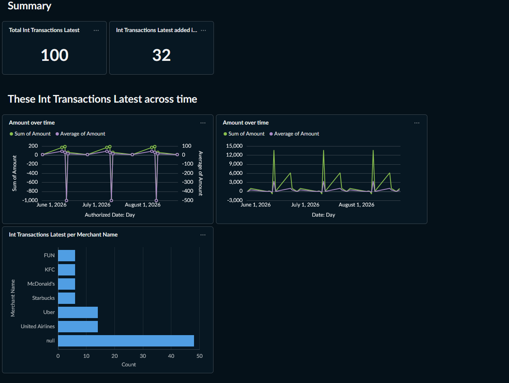

# personal-finance-pipeline

End-to-end ELT pipeline for personal finance data: Plaid API → S3 → Athena → dbt → Metabase.



*Daily net cash flow, built from Plaid Sandbox data.*

**Status:** In progress. Extraction, loading, transformation, and dashboarding work end to end
against Plaid Sandbox. Infrastructure-as-code, CI, and scheduled ingestion are not yet built.

## Motivation

Personal finance data is scattered across banks, credit cards, and brokerages, each with its
own export format. This project consolidates it into a single queryable data lake and models
it into marts for tracking net worth, cash flow, and savings rate over time.

## Architecture

Plaid API (/transactions/sync, cursor-based)
↓
sync.py ──► S3 raw layer (JSONL, partitioned by env and sync_date)
↓
AWS Glue Data Catalog (partition projection)
↓
Amazon Athena
↓
dbt: stg_transactions → int_transactions_latest → fct_daily_cash_flow
↓
Metabase


## Design notes

**Raw layer is immutable.** `sync.py` wraps each Plaid record with metadata (`item_id`,
`institution`, `change_type`, `sync_timestamp`) and writes it verbatim. No transformation
happens on ingest, so any modeling decision can be revisited without re-extracting.

**Incremental sync.** `/transactions/sync` returns `added`, `modified`, and `removed` since
the last cursor. The cursor is persisted per Item and written only after the S3 upload
succeeds — a failure between the two causes a re-fetch rather than data loss.

**Deduplication.** Because the raw layer accumulates every sync, a transaction can appear
multiple times as it is modified. `int_transactions_latest` keeps only the most recent
version of each `transaction_id` and excludes records that were later removed.

**Partition projection.** Athena computes partition values from the `sync_date` path pattern
rather than requiring `MSCK REPAIR TABLE` after each load, so new data is queryable the
moment it lands.

**Environment separation.** Sandbox and production data are written to separate S3 prefixes
and catalogued as separate Athena tables. dbt targets select between them, so the same models
build against either without mixing real and synthetic data.

**Marts are Parquet.** dbt materializes mart models as GZIP-compressed Parquet, so dashboard
queries read a columnar table rather than rescanning the raw JSONL. The raw layer stays JSONL
for auditability.

## Current state

- [x] Plaid Link integration — link token creation and public token exchange
- [x] Transaction sync via `/transactions/sync` with cursor-based incremental loads
- [x] S3 landing zone partitioned by environment and sync date
- [x] Glue catalog and Athena external tables with partition projection
- [x] dbt staging, intermediate, and mart models
- [x] dbt schema tests and singular tests, including an emptiness guard
- [x] Metabase dashboard over the mart layer
- [ ] Additional marts — spending by category, asset allocation, net worth
- [ ] GitHub Actions CI running `dbt build`
- [ ] Terraform infrastructure
- [ ] Scheduled Lambda ingestion with tokens in SSM Parameter Store
- [ ] Hosted Metabase instance

## Known limitations

- Runs against Plaid Sandbox. Sandbox does not simulate pending transactions settling over
  time, so the `modified` and `removed` code paths are reasoned about but not observed
  against real settlement behaviour.
- Transfers between a user's own accounts are not yet excluded from cash flow, which
  inflates both inflow and outflow.
- `projection.sync_date.range` starts at a hardcoded date; it must be on or before the
  first sync.
- Metabase runs locally in Docker; the dashboard is not currently hosted.

## Repository layout

app.py one-time local Flask app for obtaining Plaid access tokens
plaid_client.py shared Plaid API client construction
sync.py pulls transactions and writes partitioned JSONL to S3
sql/ Athena DDL for the raw external tables
finance_pipeline/ dbt project
models/staging/ flattening and type casting
models/intermediate/ deduplication to latest version per transaction
models/marts/ daily cash flow fact
tests/ singular data tests
docs/images/ dashboard screenshots


## Local setup

```bash
python3 -m venv .venv
source .venv/bin/activate
pip install -r requirements.txt
```

Copy `.env.example` to `.env` and fill in Plaid credentials, `PLAID_ENV`, and your S3 bucket
name.

Obtain access tokens (once per institution):

```bash
python app.py
```

Visit `localhost:5000` and complete the Plaid Link flow. Sandbox credentials are
`user_good` / `pass_good`. Tokens are written to a gitignored `tokens.json`.

Then sync and build:

```bash
python sync.py
cd finance_pipeline && dbt build --target dev
```

dbt connection settings live in `~/.dbt/profiles.yml` and are not committed. The `dev` target
reads sandbox data; `prod` reads production.

### Dashboard

```bash
docker volume create metabase-data
docker run -d -p 3000:3000 -v metabase-data:/metabase.db --name metabase metabase/metabase
```

Open `localhost:3000` and add an Amazon Athena database pointed at the relevant dbt schema.

## Notes

`app.py` is a one-time local utility, not a deployed service. The production pipeline is
intended to run as a scheduled Lambda with no web server.
